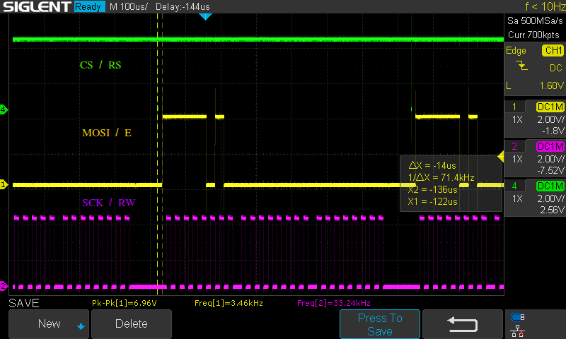

# About
the repository provides source-code for building a linux kernel module to interface a st7920-based graphic lcd.
Alongside the kernelmodule, a simple c demo is provided to write and clear the screen.

the driver expects, that the device-tree contains a corresponding node:
>  
    &spi1 {
    #address-cells = <1>;
	#size-cells = <0>;   
	pinctrl-names = "default";
    pinctrl-0 = <&spi1_pins>;
    status = "okay";
 	
	cs-gpios = <0>;
    st7920: st7920@0 {
			compatible = "glcd,st7920";
			reg = <0x0>;
			spi-max-frequency = <40000>;
			spi-bits-per-word = <8>;
			status = "okay";
			spi-cs-high;
			};
    };

# Building Software
git clone https://github.com/KaiStaud/st7920-kerneldriver \
cd st7920-kerneldriver \
make -C module all \
gcc -o lcdctl -C demo/demo.c 

# Using Module

Load the module with "insmod st7920.ko"
your linux system should contain a new char-device /dev/glcd.
If the char-device is not enumerating, follow the "FAQ".
Usage is quite simple:

> echo "hello" > /dev/glcd \
sudo ./lcdctl "hello"

# Connections

| SPI-Signal | LCD-Signal 
|------------|------------|
| MISO       | /          | 
| MOSI       | RW         |
| SCK        | E          |
| CS         | RS         |

lkm (Linux loadable Kernel Module) source for building a st7920 hardware driver. 
tested with following Targets:
- Raspberry Pi 4a (Linux 6.1.0)
- Beaglebone Black (Linux 5.10.0)

# capabilities
- char device functions: read , write
- clear
- userspace Control applikation (lcdctl)
- spi interface
- cs with gpio or hardware cs
 
# FAQ / Common Issues
- Device is enumerated correctly, but display does not display
	there are two common pitfalls: Incorrect idle voltage of your MOSI-Signal and not correct driven RS Signal.
	Check with a Oscilloscope, that your device generates a Signal as shown below:

- Kernel-Log shows "unable to send data /cmd"
	the device-tree does not contain a glcd-node,therefore the driver cannot attach to the spi-master.

- Screen shows incorrect data
	The spi-frequency is probably to fast. Provide crisp signals to the lcd to avoid misinterpretation of spi-signals

# To-Do:
- Files for Reset / Fonts
- Docs 
- Draw monochrome bitmaps 
- brightness
- on/off
- contrast
- flip Display
- Font size
- invert full rows
## packaging and deployment
- build as dkms-debian package
- provide as yocto-layer

# t.b.d:
- c-style library top wrap ioctl
- dma sometime bugged
- Split in middle (two pseudeo Displays)